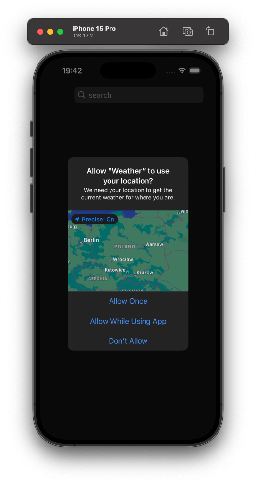
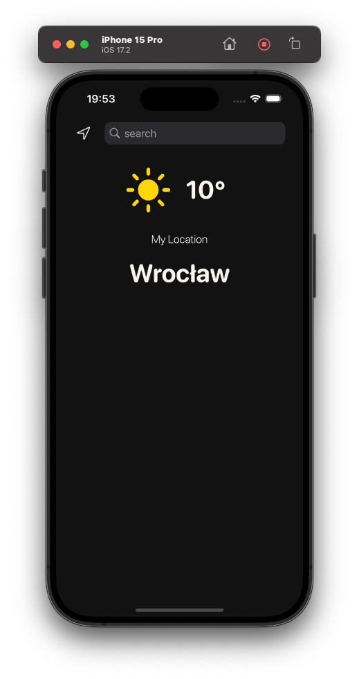
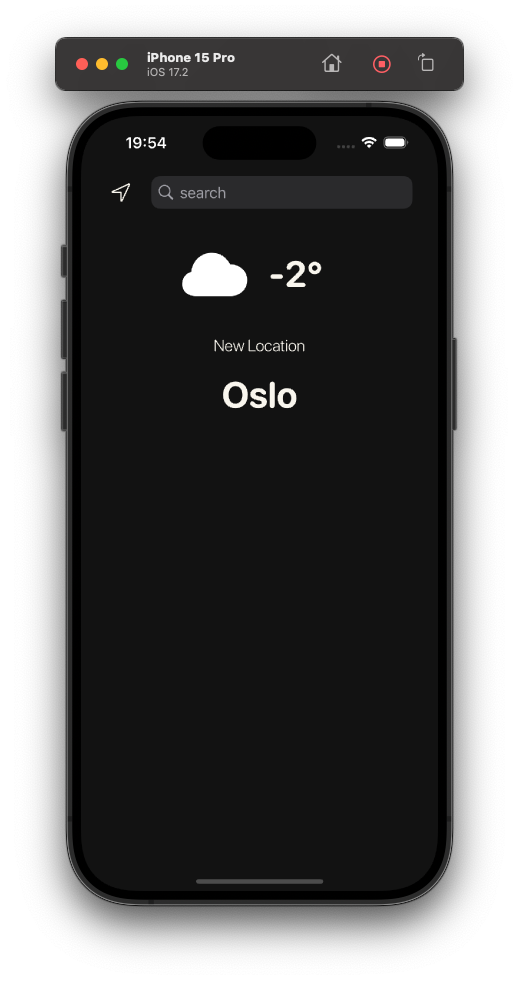
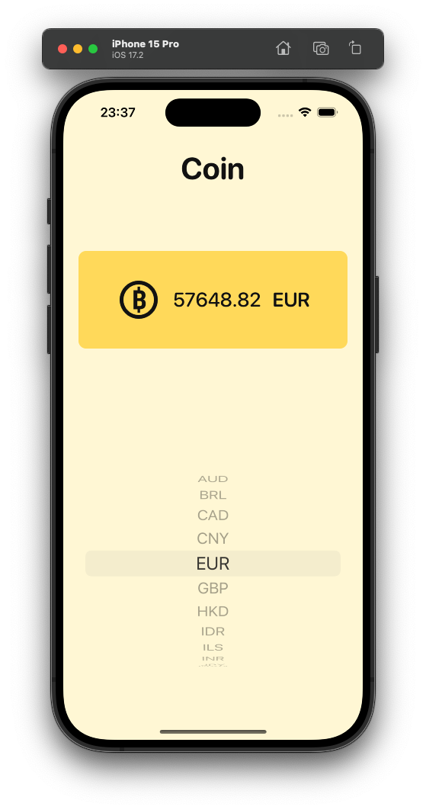

# iOS-Apps
iOS Apps created for self development and practice.

 

## Table of contents

- [Split Bill](#split-bill)
- [Weather](#weather)
- [Coin](#coin)

 

## Split Bill
Simple bill splitting, tip calculating app.

<h3>Illustrations</h3

 

<h3>Features</h3>

- Split bill depending on the tip chosen and number of people to split
- With a click it recalculates how much each person owns

 

## Weather
Weather app providing current location temperature as well as from any city in the world.

<h3>Illustrations</h3

  

<h3>Features</h3>

- Implementation of user's permissions as per Apple standards
- Dark Mode Support
- Up to date current weather data with temperature, city, weather symbol
- current location refresh button
- search option for any city's weather
- Implementation of Delegate Design Pattern
- Project structure based on MVC
- Using OpenWeather API : https://openweathermap.org
- Secure API Key using Enviroment variable (Generated API key required)
- URLSession for networking
- JSON Decoding
- DispatchQueue for performance
- CoreLocation
- Auto Layout for all iPhones

 

## Coin
Coin app providing latest bitcoin price rates in different currencies.

<h3>Illustrations</h3

<h3>Features</h3>

- Latest bitcoin price rate in different currencies
- Dark Mode Support
- Implementation of Delegate Design Pattern
- Project structure based on MVC
- Using CoinAPI : https://www.coinapi.io
- Secure API Key using Enviroment variable (Generated API key required)
- URLSession for networking
- JSON Decoding
- DispatchQueue for performance
- Auto Layout for all iPhones
