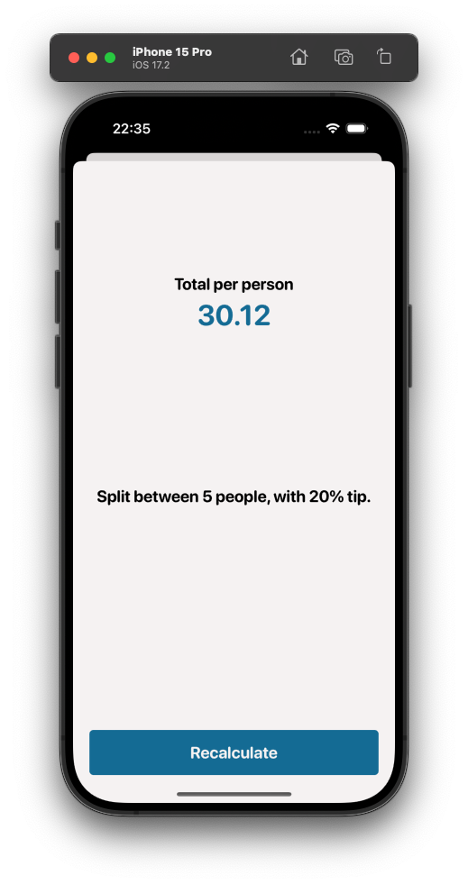

# iOS-Apps
iOS Apps created for self development and practice.

 

## Table of contents

- [Split Bill](#split-bill)
- [Weather](#weather)
- [Coin](#coin)
- [Hello](#hello)

 

## Split Bill
Simple bill split, tip calculating app.

<h3>Illustrations</h3

<h3>Features</h3>

- Split bill depending on the tip chosen and number of people to split
- With a click it recalculates how much each person owns

 

## Weather
Weather app provides current location temperature as well as from any city in the world.

<h3>Illustrations</h3

<h3>Features</h3>

- Implementation of user's permissions as per Apple standards
- Dark Mode Support
- Up to date current weather data with temperature, city, weather symbol
- current location refresh button
- search option for any city's weather
- Implementation of Delegate Design Pattern
- Project structure based on MVC
- Using OpenWeather API : https://openweathermap.org
- Secure API Key using Enviroment variable (Generated API key required)
- URLSession for networking
- JSON Decoding
- DispatchQueue for performance
- CoreLocation
- Auto Layout for all iPhones

 

## Coin
Coin app provides latest bitcoin price rates in different currencies.

<h3>Illustrations</h3

<h3>Features</h3>

- Latest bitcoin price rate in different currencies
- Dark Mode Support
- Implementation of Delegate Design Pattern
- Project structure based on MVC
- Using CoinAPI : https://www.coinapi.io
- Secure API Key using Enviroment variable (Generated API key required)
- URLSession for networking
- JSON Decoding
- DispatchQueue for performance
- Auto Layout for all iPhones

 

## Hello
'Hello' chat app provides account creation, signing in/out and messaging with users in real time using Firebase database.

<h3>Illustrations</h3

<h3>Features</h3>

- Screens: Welcome, Create Account, Sign In, Chat
- Configuration of Cocoapods
- Logo animation on Welcome Screen using CLTypingLabel Pod
- Account creation and login using email and password [Validation from Firebase with red label]
- Using Firebase to store chat data [login credentials, chat conversation] : http://firebase.google.com
- Configuration of Swift Package Manager
- Managing keyboard for messaging using IQKeyboardManagerSwift from SPM
- Implementation of Sign Out to Welcome screen
- Database management and security rules config in Firebase Console
- Custom Fonts and colors as per Apple Human Guidelines
- Implementation of chat empty message validation when sent
- Tested with 2 accounts on 2 separate devices with simple chat [Images in ReadMe]
- Dark Mode Support
- Project structure based on MVC
- DispatchQueue for performance
- Auto Layout for all iPhones

 

**Please note that this project requires own Firebase configuration with GoogleService-info file**